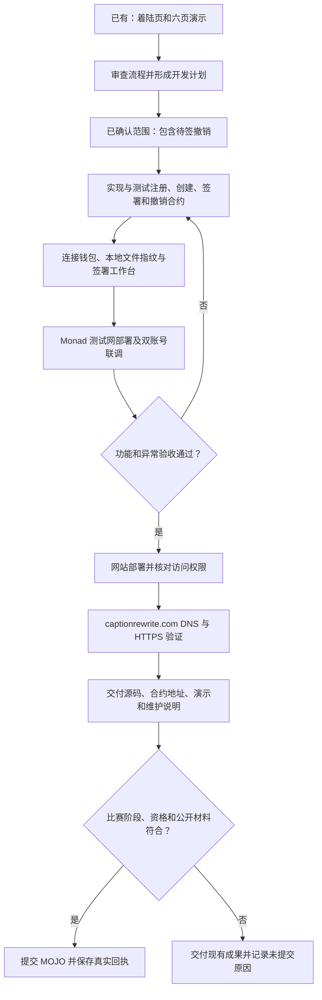
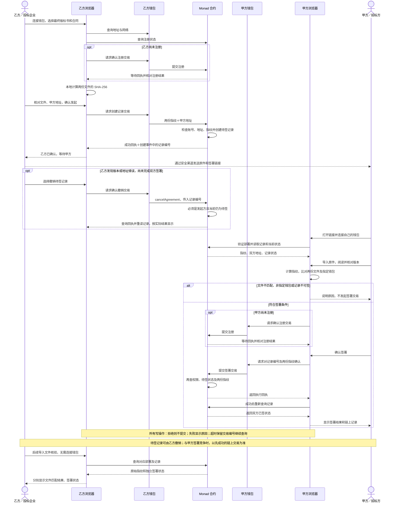

# 交付流程与签署时序审查

状态：开发基线已补齐；用户已同意补齐待签撤销及异常规则，当前等待开始编码。不是合约安全审计或实测通过。负责人：当前 Codex 主代理。日期：2026-09-05。

## 审查结论

原交付图方向正确；原时序图只有主要成功路径，不能直接作为完整实现规格。当前网页为已上线的私有产品介绍与六页演示，链上业务尚未实现。

| 原图问题 | 修订规则 |
| --- | --- |
| 发起动作是否等于乙方签署不够明确 | 发起交易确认的是指定甲方与两份固定指纹；发起方确认发生在该交易成功后。只有甲方再确认才叫双方已签。 |
| 两个用户共用“网站/钱包”泳道容易误读 | 分开乙方浏览器和甲方浏览器；钱包请求来自各自页面，平台不产生或保管其私钥。 |
| 注册每次都执行 | 先查询注册状态，未注册才发送注册交易；只读核验不需要注册或连接钱包。 |
| 钱包确认后直接显示成功 | 先获得交易编号，等待回执、检查执行结果并重新读取链上状态；超时属于未知/查询中，不能判失败并自动重发。 |
| 前端禁用按钮像是唯一权限保护 | 合约检查调用者、注册、记录存在、待签状态及两份指纹；即使绕过页面调用也不能冒签。 |
| 未区分文件一致与签署完成 | 展示两个独立维度：两份文件逐一是否匹配；记录是待甲方签署/双方已签/已撤销。 |
| 版本改动后旧邀请仍可签 | 允许发起方撤销待签记录；旧记录不能改写，已签记录不能单方撤销。需要新版时新建记录。 |
| 分享记录编号可能串链或串合约 | 标识是 chainId + contractAddress + agreementId。链接只允许当前已发布部署，其他部署只提示不支持，不能任意授权陌生合约。 |
| 仅仅部署私有站点便可参赛 | 公共演示可访问、域名验证、真实截图、仓库可见性和平台资格是独立交付条件；不能用当前私有站点冒充已满足。 |
| 数字指纹被理解为全文/企业身份验证 | 指纹是文件字节一致性核验；地址和签署状态仍公开，不证明文件内容真实、签署人获企业授权或已阅读全文。 |

## 修订交付流程图



网站开发、域名接入、参赛提交分开记录完成状态。DNS 受阻不阻止继续功能开发；比赛过期不冒充已按时提交。

## 修订业务时序图



图中回执返回是浏览器通过 RPC 查询得到，不是合约主动向网站推送。注册或创建失败就停止对应后续步骤；签署交易只有成功且重读一致才显示成功。

## 状态与接口基线

业务状态：不存在 → 待甲方签署 → 双方已签；待甲方签署 → 已撤销。双方已签和已撤销均为终态。修改任一文件产生新记录，不覆盖历史；新记录不会自动使其他记录失效。
交易状态独立：待钱包确认 → 已提交/查询中 → 成功或链上失败。超时/掉线为状态未知；钱包取消提交与业务撤销是不同动作。

```solidity
register()
createAgreement(bytes32 bidHash, bytes32 contractHash, address counterparty) returns (uint256 id)
signAgreement(uint256 id, bytes32 bidHash, bytes32 contractHash)
cancelAgreement(uint256 id)
registered(address account) view returns (bool)
agreements(uint256 id) view returns (Agreement)
agreementCount() view returns (uint256)
```

Agreement 字段：creator、counterparty、bidHash、contractHash、createdAt、status、signedAt；status 编码 0=不存在、1=待签、2=已签、3=已撤销。不能依赖旧测试的布尔 signed 下标。保留 Registered / AgreementCreated / AgreementSigned，新增 AgreementCancelled 事件。

前端固定按原始字节 SHA-256；不重新渲染 PDF 或规范化 DOCX。标书和合同分别比对，不能交换顺序。重新保存但看起来相同的文件也可能字节不同。合约只能比对提交的指纹，不能检查用户是否真正持有、阅读了原文。
文件限定每份大于 0 且不超过 10 MiB；仅本地内存，不存服务器或 localStorage。链上存地址、指纹与状态；本地仅保存公开记录编号和待确认交易信息。

## 验收覆盖与限制

- 正常：双方注册 → 创建 → 甲方签署 → 两份原件核验一致。
- 权限：未注册、第三方、发起人冒签、零地址、自签、不存在记录全部拒绝。
- 文件：空文件、过大、异步替换文件、调换两份文件、任一字节变更不能错误显示匹配。
- 生命周期：已签不可重签/撤销；已撤销不可签；签署/撤销两种执行顺序均测试。
- 恢复：拒绝钱包、切错链、切账号、余额不足、RPC 失败、刷新、交易替换/取消、超时不自动重发。
- 分享：陌生部署和非法编号不可操作；记录编号从交易事件获取，不读全局计数猜测。
- 隐私：请求和存储检查确认原件不离开浏览器；不宣传指纹存证为完全匿名或永久保存。

核对来源：[Monad 测试网官方信息](https://docs.monad.xyz/developer-essentials/testnet)；[viem 交易回执与替换](https://viem.sh/docs/actions/public/waitForTransactionReceipt)。本轮查阅 2026-09-05。测试网文档有重置历史，不能承诺测试记录永久留存。上列业务规则为本项目设计判断，不是官方提供的签约功能。


## 撤销操作与失败恢复补充

| 情况 | 合约规则 | 页面显示与后续 |
| --- | --- | --- |
| 发起方撤销待签记录 | creator 且 status=1 才允许，改为 3，发出 AgreementCancelled | 成功回执并重读后显示“已撤销”；保留历史，不删除 |
| 第三方、甲方或不存在的记录尝试撤销 | 拒绝；状态不变 | 显示无权限或记录不存在 |
| 甲方先签成功，乙方撤销随后执行 | 撤销失败；status=2 | 显示“对方已签署，无法撤销”，不显示撤销成功 |
| 乙方先撤销成功，甲方签署随后执行 | 签署失败；status=3 | 显示“记录已撤销”，停止继续签署 |
| 撤销钱包弹窗被拒绝 | 无业务撤销交易 | 保留待签状态，可重新操作 |
| 撤销交易超时或 RPC 断开 | 结果未知，不假定成功/失败 | 保留交易编号，禁用重复提交；查询恢复后重读 |
| 文件一致但记录已撤销 | 文件比较仍可为一致 | 同时显示“文件一致”和“已撤销，不可签署” |
| 请求换文件或换甲方 | 原记录字段不可改写 | 待签先撤销；确认撤销成功后新建。已签只能另建，旧记录仍保留 |

撤销不需要重新选择原文件；授权来自调用者地址和链上状态。取消钱包弹窗不等于撤销记录；Gas 已花费也不等于业务成功。
注册、创建和签署任何一步失败都停止该条后续流程；恢复时从当前链上状态接续。读取失败不伪装成记录不存在。新旧记录不建立自动法律替代关系。

## 冻结接口细节

合约只接受指纹 bytes32；固定不变量：createdAt、双方地址和两份指纹创建后不改变，signedAt 仅成功签署时写入，撤销不写签署时间。零指纹、零甲方、自签、未注册发起都拒绝；甲方允许受邀时未注册，签署前必须注册。
事件参数：Registered(account indexed)；AgreementCreated(id indexed, creator indexed, counterparty indexed)；AgreementSigned(id indexed, signer indexed)；AgreementCancelled(id indexed, creator indexed)。
若使用 public mapping，Solidity getter ABI 返回展开字段；lib/chain.ts 显式转换成计划中的 Agreement 对象，不假设 ABI 自动返回对象或沿用旧布尔字段索引。

补齐验收：撤销权限、两种竞争顺序、撤销拒签/超时、撤销后核验、已签终态、成功后重读、换版重建均映射到计划 M1/M3/M4/M5。文档通过不代表这些测试已经运行。
